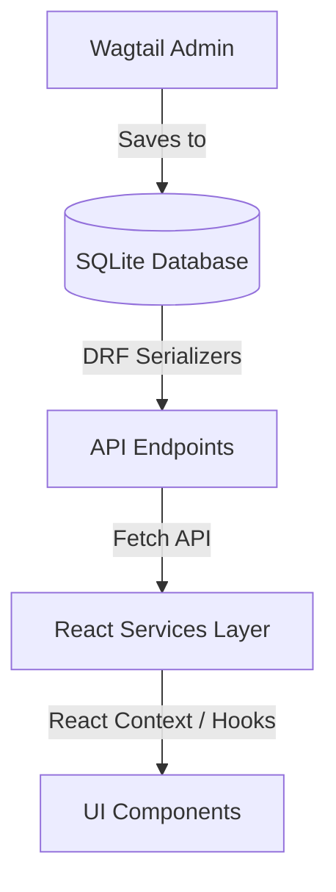

# MR.WILLOW - Project Architecture Overview

Welcome to the MR.WILLOW codebase. This document outlines the project structure, design patterns, media pipelines, and API integrations for future developers.

---

## 1. Backend Structure (Django & Wagtail)

The backend is built with Django and Wagtail CMS. It serves structured REST API payloads to the React frontend.

### Main Modules:
- **`mrwillow/`**: Core project configurations, settings (base, dev, prod), and routing.
- **`homepage/`**: HomePage model, settings model, and database structures.
  - Defines the global `BusinessSettings` and operating hours using Wagtail's settings framework (`BaseSiteSetting`).
- **`workshop/`**: Workshop page models and inline gallery definitions.
- **`products/` / `store_collections/` / `brands/`**: Catalog entities for inventory management.
- **`api/`**: Viewsets, view endpoints, and DRF (Django REST Framework) serializers translating Wagtail pages and database items to API payloads.

---

## 2. API & Data Flow

All endpoints reside under `/api/` and are resolved dynamically in `views.py`.



### Key Endpoints:
- `/api/business-settings/`: Global settings (Announcement text, contact numbers, hours, socials).
- `/api/homepage/`: Hero titles, subtitles, dynamic statistics, and fallback variables.
- `/api/workshop/`: Media items, list of services, and descriptions.
- `/api/products/`: Catalog inventory list (supports query filters e.g. `?is_featured=true`).

---

## 3. Media & Asset Pipeline

Media uploads (such as bat details, workshop photos, and videos) pass through a dedicated serializer mapper to prevent broken image references during local development.

```mermaid
graph LR;
    Asset[Uploaded Image] -->|Wagtail Image Storage| LocalStorage[/media/images/*]
    LocalStorage -->|get_image_url helper| Serializer[DRF Serializer]
    Serializer -->|Build Absolute URI| Frontend[Absolute URL: http://localhost:8000/media/*]
```

### Absolute URL Generation:
In `api/serializers.py`, `get_image_url(image, request)` reads the serializer context request to translate relative paths (e.g. `/media/images/filename.jpg`) into absolute URIs (e.g. `http://localhost:8000/media/images/filename.jpg`) when using local `FileSystemStorage`. If Cloudinary storage is configured, it resolves to absolute Cloudinary CDN links.

---

## 4. Frontend Structure (React & Vite)

The frontend is organized to separate layout shells, pages, service clients, contexts, and TypeScript definitions.

```
src/
├── app/                  # Main Router and Root Component (App.tsx)
├── assets/               # Local static svg logos and styling assets
├── components/
│   ├── canvas/           # Three.js 3D bat canvas rendering
│   ├── layout/           # Shared page wrappers, Navigation, Footer, Announcements
│   ├── sections/         # Sub-components grouped by page or feature section
│   └── ui/               # Lower-level styled design blocks
├── contexts/             # React contexts (InquiryContext, BusinessSettingsContext)
├── lib/                  # Helpers and constants (constants.ts)
├── pages/                # Top-level Page views (Home, Collections, Services, CustomBats)
├── services/             # Dynamic backend API fetch services (api.ts, settings.ts, etc.)
├── styles/               # Main Tailwind / Vanilla CSS index file
└── types/                # Centralized TypeScript interfaces (brand, product, settings)
```

---

## 5. Global Business Settings Flow

Global store settings (such as phone numbers, emails, addresses, and announcements) are fetched once during the layout mount phase and distributed globally.

1. **`BusinessSettingsProvider`** (`src/contexts/BusinessSettingsContext.tsx`) triggers `getBusinessSettings()` on mount.
2. The resolved config is cached in state and distributed via context.
3. Sub-components (like `Navigation`, `Footer`, and `AnnouncementBar`) consume details using the `useBusinessSettings()` hook.
4. **Custom Bat Builder toggle**: The boolean field `custom_bat_orders_enabled` is evaluated globally. If false, the builder disables the direct WhatsApp CTA and replaces it with an informative banner.
